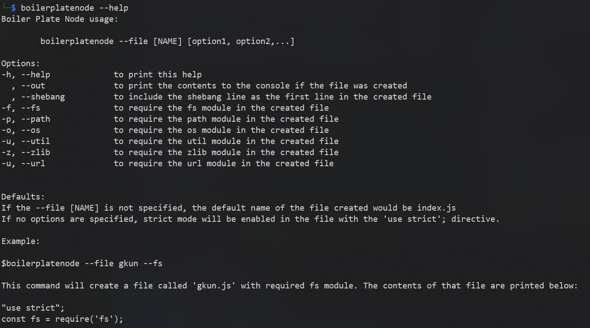
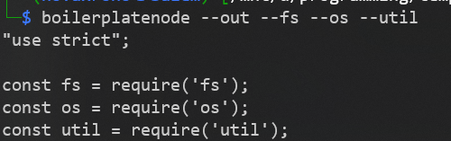
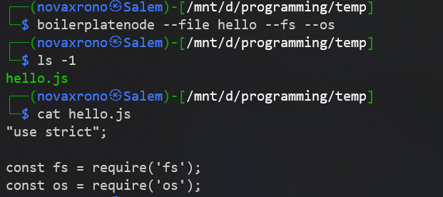

# boilerplatenode

> This is a node cli package intended for generating the starter code for any node file, module or package.

## Table of contents

* [General info](#general-info)
* [Screenshots](#screenshots)
* [Technologies](#technologies)
* [Setup](#setup)
* [Features](#features)
* [Status](#status)
* [Inspiration](#inspiration)
* [Contact](#contact)

## General info

Instead of having to create .js files and having to import same utilities time and again, let `boilerplatenode` handle this work for you. Just run it as a regular command after linking it and pass the appropriate flags for importing these system modules. `boilerplatenode` automates this work. You can take this further and even write shell scripts calling this command and it would generate as many files as you want.

It doesn't have any dependencies and hence it'll work with a system that has node installed without requiring anything else.

## Screenshots
1. To access help use `--help` flag.

2. Use the `--out` flag to see the content that will be written to the file.

3. Use the `--file [NAME]` option to enter a filename without the .js extension or the default created file would be named index.js.

## Technologies

* NodeJS - version 14.15.0
* Windows Terminal
* Bash shell and any other POSIX based environment.

## Setup

1. Install Node from [NodeJS.org](https://nodejs.org/en/)
2. Clone the [git repository](https://github.com/Goku-kun/boilerplatenode) and cd into the repository.
3. Use the command `npm link boilerplatenode`.
4. You can now use this as an executable command systemwide as `boilerplatenode --file [NAME] [options]` or `bpn --file [NAME] [options]`.
5. print help using `boilerplatenode --help`.

## Features

* Use systemwide after linking.
* 0 dependencies; Only uses node core modules.
* Automate the workflow by generating .js files on the file with this package.

To-do list:

* ADD functionality for passing filename as option in the shell environment. ✅
* Write unit tests for the functionality.
* Make it more flexible by passing number of files to be generated. 

## Status

Project is: _in progress_ 

## Inspiration

The sole inspiration for creating this package is to automate the daily task of creating files using `touch` and then importing the same boiler plate code everyday before starting to write some actual implementation of the new program.

## Contact

Created by [@Goku-kun](https://www.github.com/Goku-kun) - feel free to contact me!
Link to this [repository](https://github.com/Goku-kun/boilerplatenode).

## License

All code and documentation are released under GNU GENERAL PUBLIC LICENSE and a copy of [license](./LICENSE) is also included in the repository.